# Installation of Code-Ready Workspace in IBM Cloud OCP4.3 Cluster:

This documentation is focused to install and configure the Codeready workspace in the IBM Cloud OCP Cluster 4.3. The steps regarding the installation and configuration are detailed out as below:

### Step 1: Login to the IBM Cloud Environment.

### Step 2: Ensure you have provisioned the OCP4.3 Cluster in the  IBM Cloud.

### Step 3: Access the OCP Cluster that is provisioned. The Provisioned OCP Cluster Overview screen appears as below

### Step 4: Open the Openshift web console. It can be accessed by clicking the button that appears “Openshift web console” in blue at the top of OCP Cluster Overview Screen. Please refer to the image in step 3

# Installation of CodeReady workspace Operator:

### Step 5: The navigation will take you to the dashboard view of the OCP Console as below:

Ensure you have the Administrator Permission to install the Code-Ready Operator. Highlighted as below

### Step 6: Now Navigate to the Operators in the left Pane and then navigate to the operators Hub.

Select the Project where you want to install the Codeready operator

### Step 7: Search the Filter using “CodeReady Workspace”.  This filters to the Code Ready workspace Operator as shown below

### Step 8: Double click the Operator Filtered and this will navigate to the Installation User interface

### Step 9: Now Click on the Install button highlighted in Blue color. This will navigate to capture the environment information required for installing the operator.

Re-confirm/Ensure the operator to be installed In the correct namespace/project

### Step 9: Once confirming the parameters, Subscribe the Codeready workspace operator.

### Step 10: Once you scribe the operator shall get installed and appear as part of the “Installed Operators” in the Left Nav.

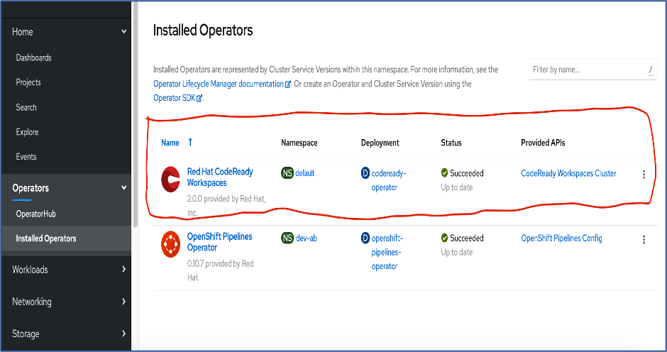

# Installation of Code Ready workspace Che-Cluster:

Once the Code-Ready Workspace operator is installed, the next step is to install the Codeready workspace cluster which is referred as “che-cluster”

## Step 11: Wait until the Code ready workspace operator is successfully installed as in step 10.  Once it is successfully installed click the link “CodeReady workspace Cluster”.

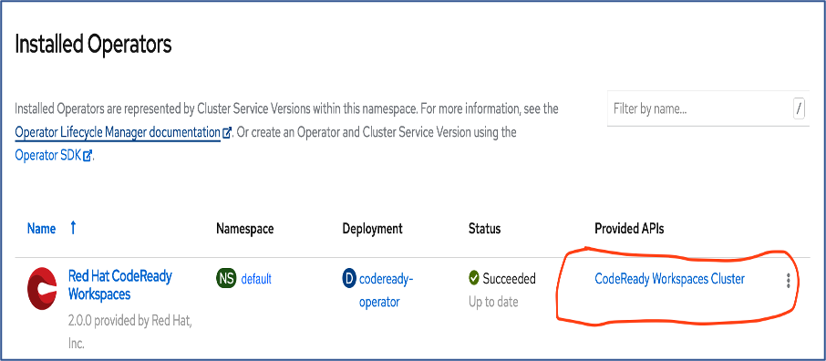

## Step 12: The page will navigate to the “CheCluster” page with list of clusters that is already installed and have “Create CheCluster” Button highlighted in “blue”.

Please note, at very first time, the page will have only “Create CheCluster” Button with no list as there is no cluster configured yet.

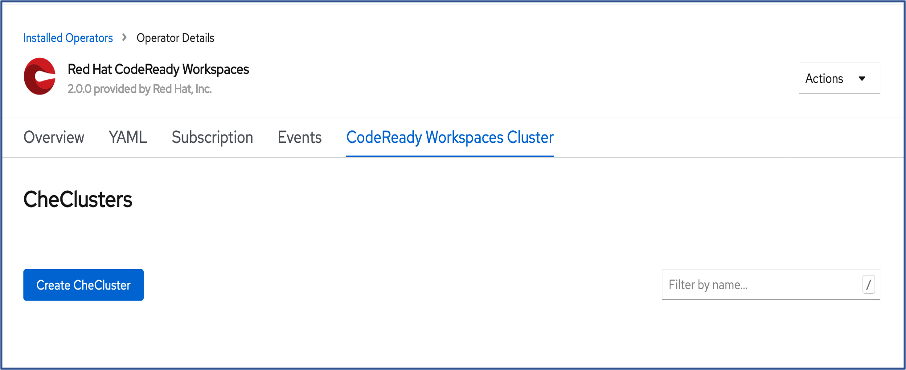

## Step 13: On the click of the Create CheCluster button, yaml configuration page shall open up. This shall enable the administrator to modify changes to configuration of the cluster by directly change the Yaml Configuration. Otherwise, the changes can also be done using the “Edit Form” link in the top left of the page.

Please note, Yaml Edit will give full control of the Object Creation. The form may not represent all the properties supported by YAML

## As part of this installation, the following changes to be done before creating the Cluster. Admin can choose either ways by directly updating the Yaml or through the “EditForm” Link

## Initially the cluster can be setup without an SSO provided through oAuth (Log in to CodeReady Workspaces with OpenShift credentials).

Please note oAuth of Openshit is one of the ways for SSO. Alternatively, External Identify Provider can also be configured for the SSO.

## 1. By default, the Openshift oAuth parameter is true.

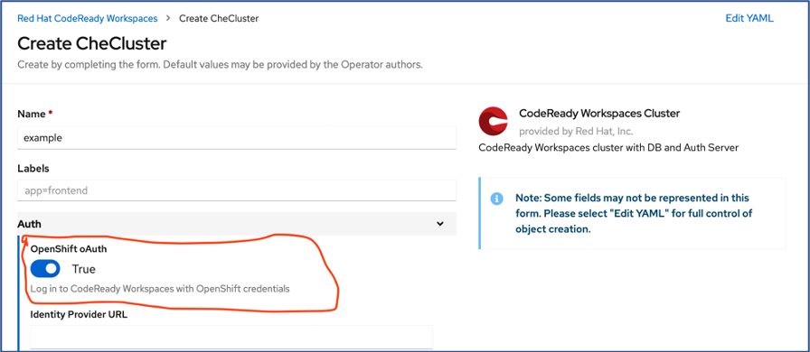

### Let us make this Openshift oAuth parameter as false.

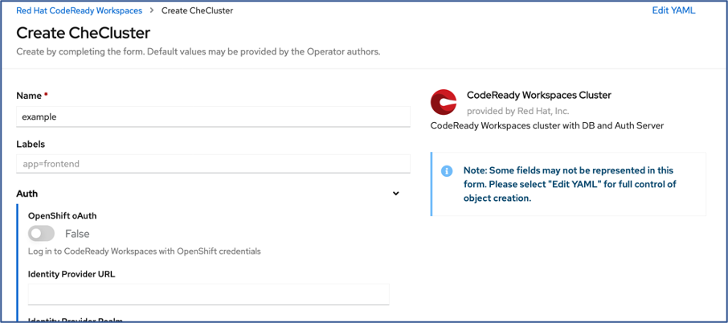

## 2. Next do navigate down the “Edit Form” page, to the Storage Area  which has certain parameter pre-filled while few others are left blank

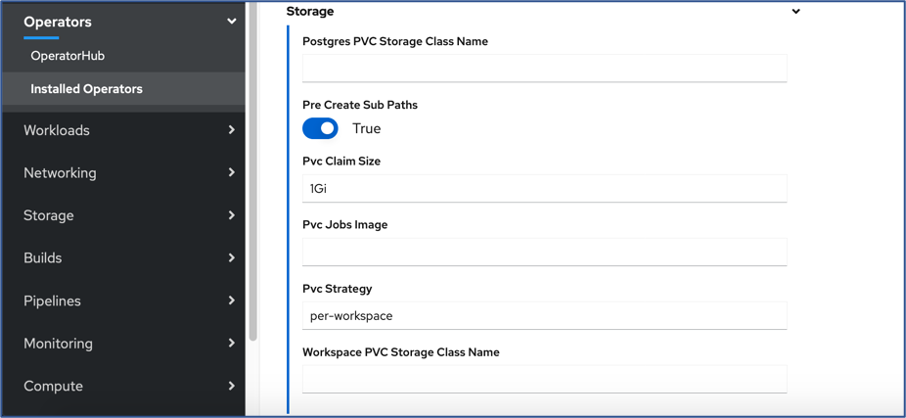

### We need to configure two parameter additionally, they are

#### a.	postgresPVCStorageClassName

####  b.	workspacePVCStorageClassName:

### By default in “Edit Form” these parameter will be empty. In the Yaml Edit these parameter would have not been defined.

### As we have postgres database part of the installation, PVC Storage Class Name and workspacePVCStorageClassName has be defined. The storage class name can be picked from on the storage classes that defined in the Cluster.

### In current scenario, we have used PVC Storage Class defined part of the IBM Cloud. We have choosen “ibmc-block-gold” for both the parameters:

#### a.	postgresPVCStorageClassName: ibmc-block-gold

#### b.	workspacePVCStorageClassName: ibmc-block-gold

### The EditForm for storage looks like

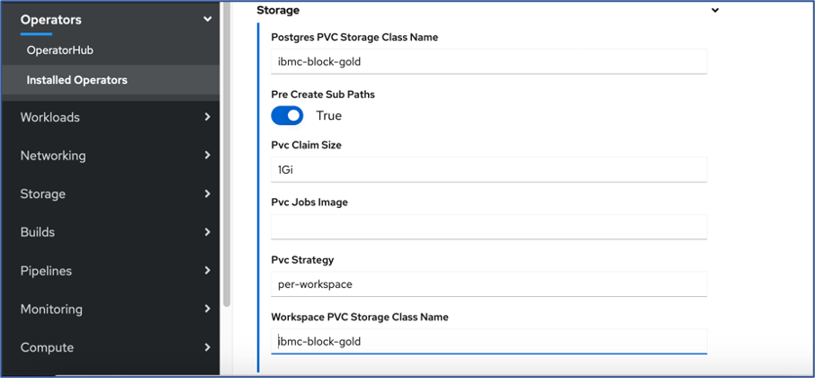

#### Leaving the other parameters as default, Now create the “Che Cluster” by clicking the “Create” button at the bottom on the Page.

## Step 14: On create, the installation of the cluster process get kicked out and pages navigates to CheCluster Over page shown below. There would a Che Cluster installation will be in process

## Step 15: Now Click the Name of Cluster link that is in progress as indicated in step 14. The installation of the cluster resources usually takes few minutes to get completed. The  screen now navigates to cluster detail page (Overview page)

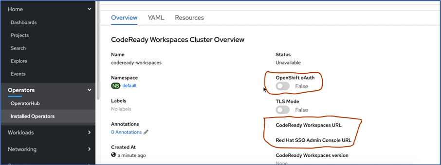

#### Please note here;

a. OpenShift oAuth is not configured

b. CodeReady Workspace URL:  The URL is currently blank. As the Cluster is provisioned, the URL shall be updated

c. Red Hat SSO Admin Console URL: Code Ready Workspace uses Keycloak based authentication.The URL will be updated as the cluster is provisioned.

Also note if SSO, is not managed the user management for CodeReady is to be managed through the SSO Admin based on Key cloak.

If SSO based through oAuth is enabled, KeyCloak will be still available and the user info will be updated once, the first time user login. However the authentication will be managed through Openshift oAuth.

## Post Successful Installation of Code Ready workspace Che-Cluster:

Once after successful Installation of the CheCluser, you can navigate between tabs of the CheCluster. They are

#### **a. the Overview Tab:**

This tab provide details related to CheCluster such as

•	oAuth configured

•	status

•	CodeReady Workspace URL

•	SSO Admin based on Keycloak URL

•	Name space the cluster is deployed

•	TLS configured

The screen shot below depicts the same

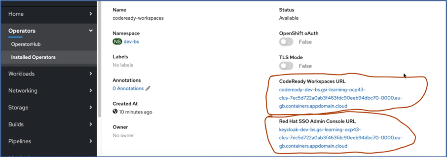

#### **b.	Yaml tab:**

The View of the Yaml tab as below

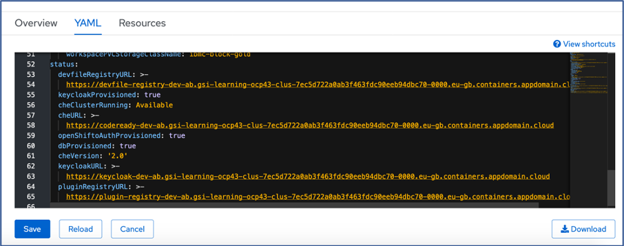

### **c. Resources tab:**

### Summary:

### Post Successful installation, retrieve the

### 1.	CodeReady Worspace access URL from the Overview tab of the CheCluster. Please note without SSO, the users have to register at the login page of the CodeReady workspace and the create the workspaces.

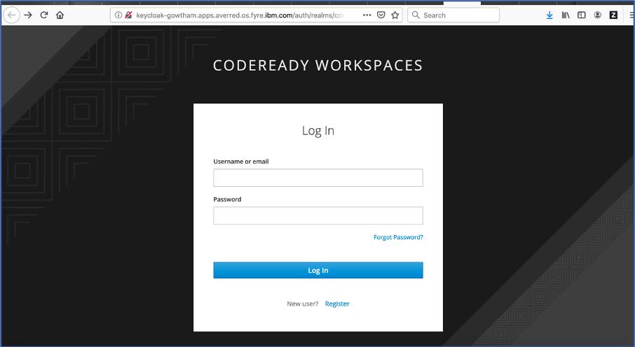

### 2. If SSO is not managed, the user administration is managed  through the RedHat SSO admin through keycloak. The URL is available at Overview tab of the CheCluster.

### 3. If SSO, is configured, the user authentication is managed through Openshift oAuth. However note, the user basic details is duplicated in keycloak as well by the codeready workspace for its usage. SSO authentication is detailed in separate section of this document.

# Configuring TLS for the Code-Ready workspace:

### TLS configuration provides the secured access to the codeready environment over the internet connection. If you remember when we do set the environment the TLS mode was disabled.

### To set up the TLS mode for the CheCluster, Administrator navigation is as follow:

### •	Ensure User has the Administrator permission

### •	Navigate Operators ->  Installed Operators

### •	The above will list out all the Operators installed in the Project/name space

### •	Identify the Red hat codeready workspace operator and click the 	CodeReady Workspace Cluster under heading “provided APIs”

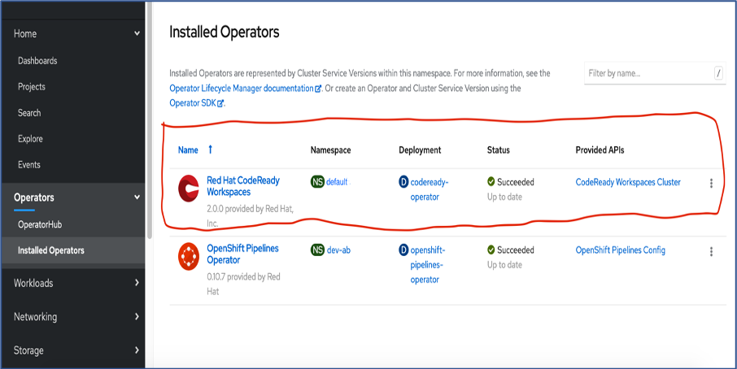

### •	Navigate the CheCluster already provisioned by clicking the name of the cluster

### •	Now under the overview tab the disabled TLS Mode can be viewed

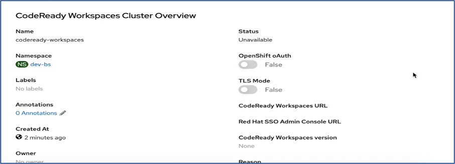

### •	By sliding the TLS mode from false to true, the TLS get enabled for the workspace.  Once the “confirm change” is clicked, the changes is applied in the environment. It would take few secs for applying the changes.

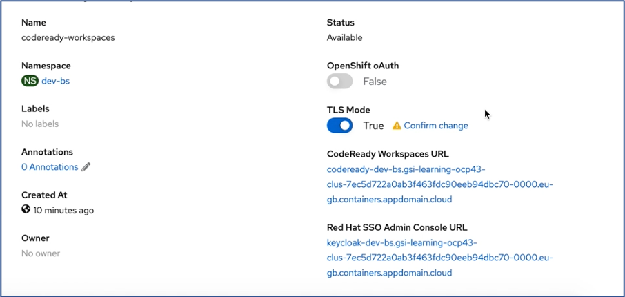

# Configuring SSO for the Code-Ready workspace:

#### During the initial installation of the Cluster, the SSO option was disabled.

### To enable the Openshift based oAuth, Administrator navigation is as follows:

•	Ensure User has the Administrator permission

•	Navigate Operators ->  Installed Operators

•	The above will list out all the Operators installed in the Project/name space

•	Identify the Red hat codeready workspace operator and click the 	CodeReady Workspace Cluster under heading “provided APIs”

### •	Navigate the CheCluster already provisioned by clicking the name of the cluster

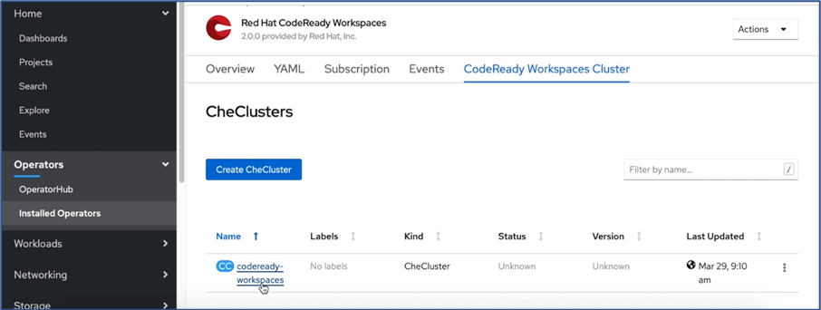

### •	Now under the overview tab the disabled oAuth Mode can be viewed

### •	By sliding the OpenShift oAuth mode from false to true, the SSO through Openshift get enabled for the workspace. Once the “confirm change” is clicked, the changes is applied in the environment. It would take few secs for applying the changes.

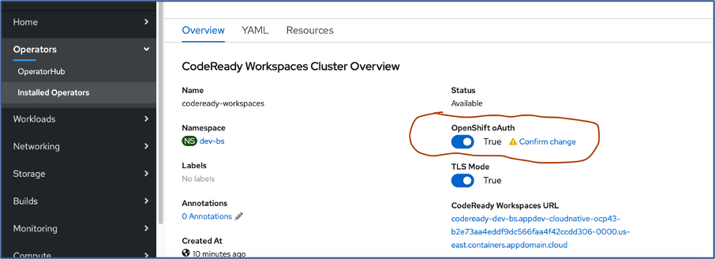

**Please note: During the first login using the CodeReady Workspace the Redhat SSO would request for update for details such as**

•	User name
By default the IBM login name will be picked as IAM#<<IBM ID>>.  This do not follow the standard Kubernetes naming convention, hence has to be changed as per standards which a-z, 0-9 and hypen(-) in between’s.  Though this is not validated during submit, this create issues during Workspace creation.

•	Email

•	First name

• Last name

**Post update details, the user interface should like as below, before you submit.Kindly provide additional care in providing correct info before submit.**

