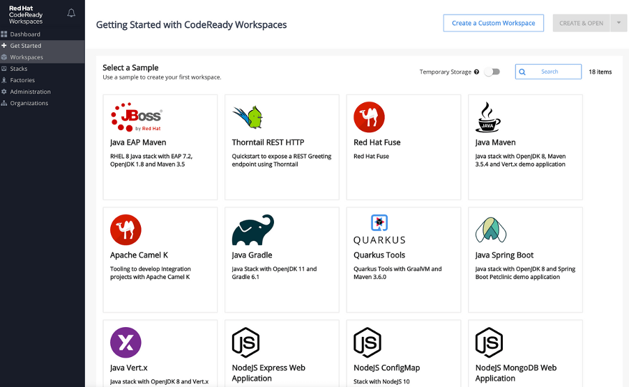
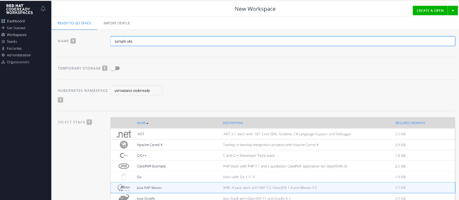
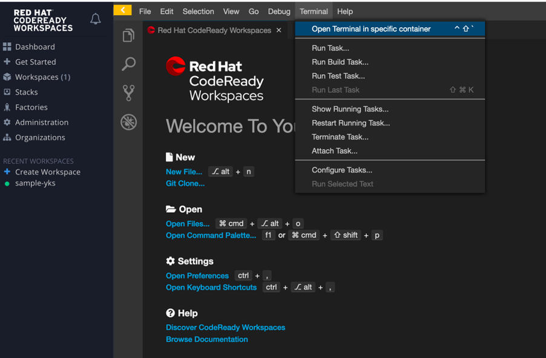
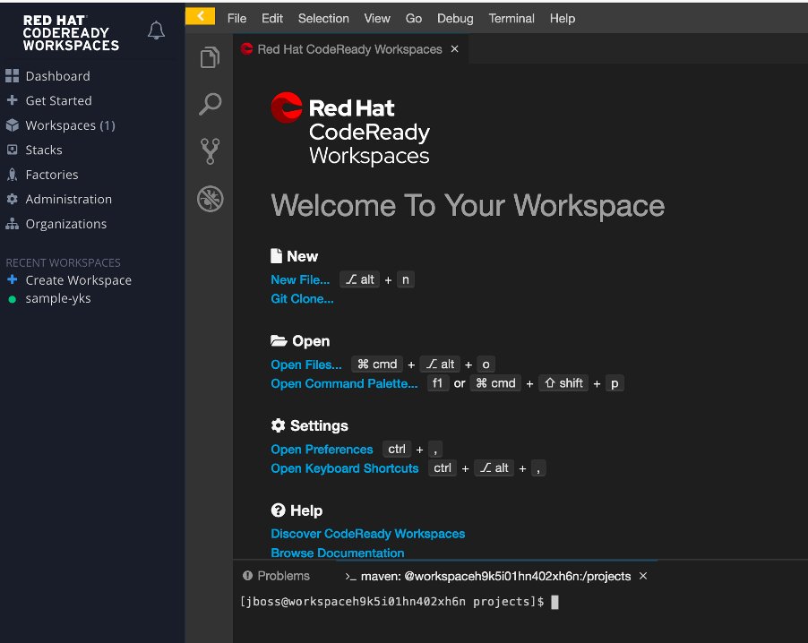
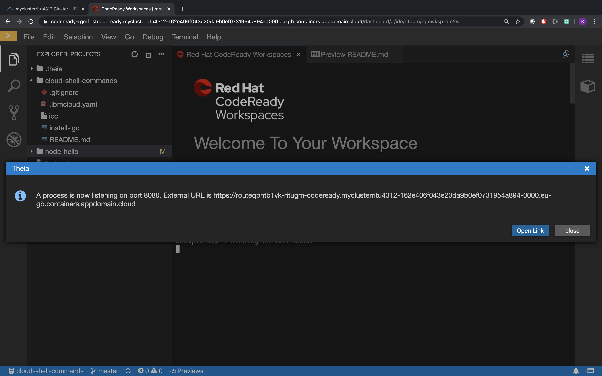
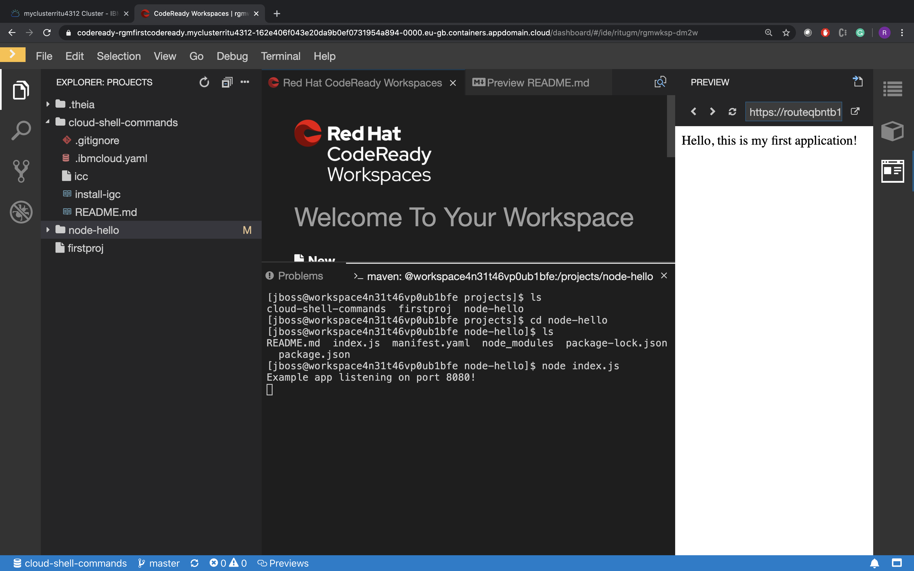

# Setting up developer workspace and running a simple Node.js application

#### The below document helps to setup the developer project workspace in Code Ready provided IDE

**Step 1:**  Login to the Open shift Cluster through the Web console, where the Code ready workspace is setup.

**Step 2:**  Access the Code Ready Workspace through the appropriate Code ready workspace URL that would have been shared.

**Step 3:** If you are accessing it for the first time you need register as the registration page will be shown.  Ensure your user name should have strictly follow .(character allowed are 0-9, a-z and hypen in between), even if default values are displace. Ensure you provide details regarding username, Email, First name and Last name (If SSO is not configured, you need provide the password as well. From the second you will be directly taken to workspace User interface in step 4

**Step 4:**  Navigate to the default page codeready workspace as loaded in the below picture



**Step 5:**  You can create the workspace as shown in the step 4  by selecting one of the template stacks displace. Alternatively navigate to the Workspace and click on the Add workspace button


**Step 6:** Provide the workspace as part of the Name Field



**Step 7:** Click on remove button: in the add and import project, basically we are going to create a empty project.


**Step 8:** Click on create and open button. Workspace will start loading. This may take few minutes as the Container and plug-ins related to the stack has be created and deployment.  Once the Workspace is created  the welcome will be displayed as depicted below


**Step 9:** Open the terminal by selecting terminal from menu:



**Step 10:** Click on open the terminal and select maven



**Step 11:** Clone the project

```
git clone https://github.com/IBMDevConnect/node-hello
```

**Step 12:** Get into the directory

```
cd node-hello
```

**Step 13:** Run the application

```
node index.js
```

**Step 14:** There will be a pop-up, please click on Open Link



**Step 15:** You should be able to get the output as shown below:



Congratulations! You have completed this workshop!
