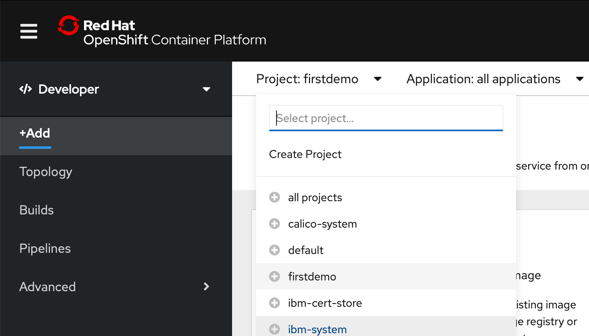
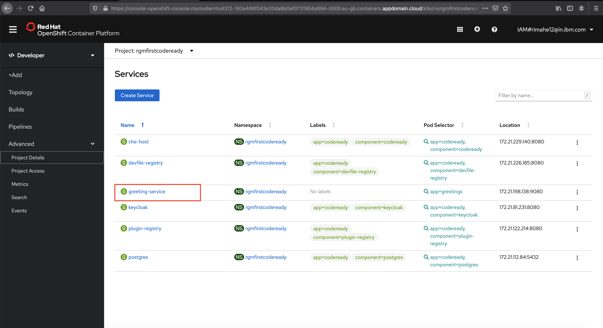
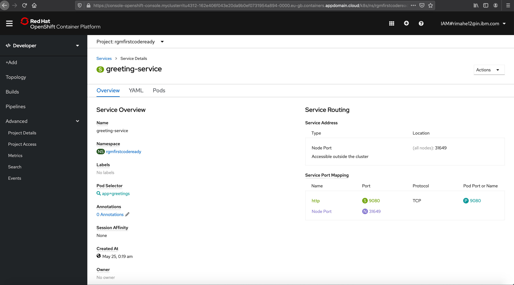
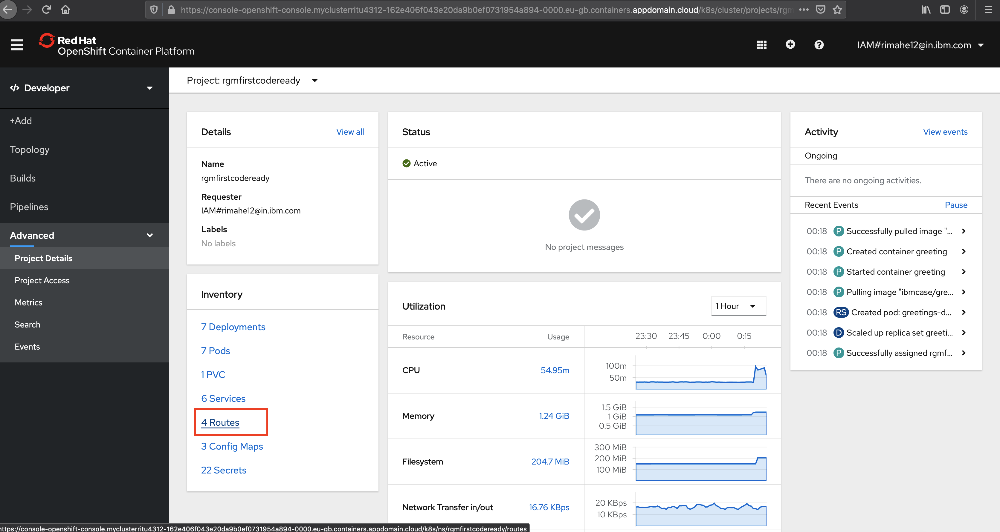
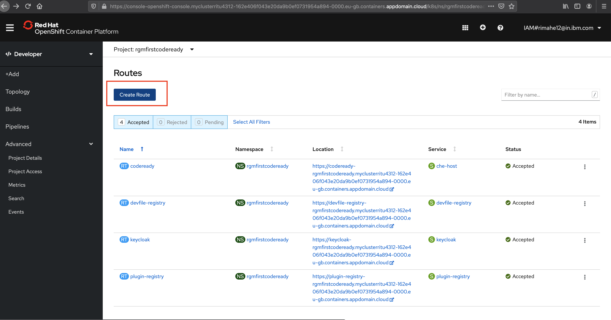
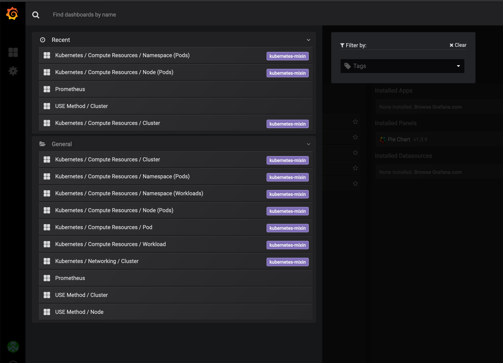
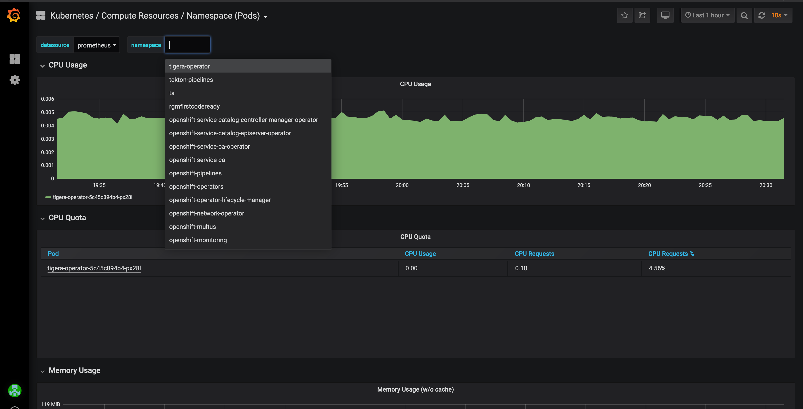

## Prerequisites

- Read and understand resource groups: [IBM Cloud Resource Groups](https://cloud.ibm.com/docs/resources?topic=resources-rgs)
- You will need an IBM Account for [IBM Cloud](https://cloud.ibm.com/)
- Downloaded and installed the OpenShift CLI at [OpenShift CLI Installation](https://OpenShift.io/docs/tasks/tools/install-kubectl/). Follow the instructions for your computer’s operating system.
- Downloaded and installed the IBM Cloud CLI at [IBM Cloud CLI Installation](https://cloud.ibm.com/docs/cli?topic=cloud-cli-getting-started#step1-install-idt). Follow the instructions for your computer’s operating system.

## IBM Cloud Login

Start by opening a web browser and navigating to [IBM Cloud](https://cloud.ibm.com/).


Next **_login_** with your IBM Cloud login you created. After login you will be navigated to your **Cloud Dashboard**.


On the **Cloud Dashboard** in the resource summary section, select **OpenShift Clusters**.


In cluster list, select the cluster you would like to access. Make sure the cluster you select has a red circle OpenShift icon next to it.

## Getting the Sample Application

Download the sample application from Github: [Sample App](https://github.com/ibm-cloud-architecture/cloudnative_sample_app/tree/Basic-Tutorial)

### Creating a project using the Developer perspective in the web console

With the OpenShift Console open, let’s **Create a Project**

#### Create Project

You can create a project using the Developer perspective, as follows:

**Step 1.** In the **Add** view, click the **Project** drop-down menu to see a list of all available projects. Select **Create Project**.



**Step 2.** In the **Create Project** dialog box, enter a unique name for the **Name** field. For example, enter **myproject** as the name of the project in the **Name** field and click on **Create**


You will see that a new project was created in the list. _Click_ on the **Project Name**.

Now you will see the project screen and it’s time to add the **deployment** and **service**.

#### Create Deployment & Service

On the left click on _+Add_ and select **YAML**


In **Finder** or **File Explorer** navigate to the **chart/cloudnativesampleapp** directory of the sample application.

Once there you will see two files: **deployment.yaml** and **service.yaml**

Drag and drop the **deployment.yaml** file first.


_Click_ **Create** and you will see a new **greetings** deployment in the console.

For **Creating a Service** we are going to repeat the steps of **importing a YAML** just like a deployment, but instead of the **deployment.yaml** we will _Drag and Drop_ the **service.yaml**.


After Creating the Service let’s navigate to the **Services** page to view it.



On this page you can see your new service named **greeting-service**. You can click on the service to view details about it.



#### Create a Route

Now we need to **Create a Route** for our new service to be reach by users outside of the cluster.

Navigate to the project Details from the left as shown below



On the service details page, find the **Create Route** button and _Click it_.



This will open a form with values prepopulated for **Creating a Route**. Give the service name, select your service which is just created and _Click_ **Create**.


Select the Target Port


A new route has now been created allowing us to access it from the internet. You can see the **Route’s Hostname**. That’s the new address for your service and we want to _Copy_ it.


Next, _Open a New Tab_ in your web browser and _paste_ the copied address in the search bar. **BEFORE pressing enter** append **/greeting?name=John** to the end of the address. Then _Press Enter_

You should see the following:


Congrats! That’s you have successfully deployed an application on OpenShift.

### Deploy Kubernetes App using oc CLI

Next open up a **Terminal** window and follow the steps from the **Accessing the OpenShift Cluster** for the CLI access. (Make sure to append "--sso" after "login" if needed).

Create A Project

Once logged in, we want to create a new project called deploy-sample in your OpenShift Cluster:

```shell
oc new-project deploy-sample
```

If you already have an existing project, you can select the project using:

oc project deploy-sample

Get the Sample Application from Github

Get the code from the Github repository, and use the branch **Basic-Tutorial**

```shell
git clone -b "Basic-Tutorial" https://github.com/ibm-cloud-architecture/cloudnative_sample_app
```

Navigate to the **chart/cloudnativesampleapp** directory of the sample application.

```shell
cd chart/cloudnativesampleapp
```

Once there you will see two files: **deployment.yaml** and **service.yaml**

Create A Deployment

After we have created the project we need to create a deployment of our application.

In next few steps we will deploy each of them. We will start with creating the deployment:

```shell
oc create -f deployment.yaml
```

To verify your deployment is created:

Verify Deployment

```shell
oc get deployment
```

You should see the followig output:

```shell
NAME                   DESIRED   CURRENT   UP-TO-DATE   AVAILABLE   AGE
greetings-deployment   1         1         1            1           36s
```

Next, we will create the service:

Create A Service

```shell
oc create -f service.yaml
```

To verify your service is created:

Verify Service

```shell
oc get svc
```

You should see the followig output:

```shell
NAME               TYPE        CLUSTER-IP      EXTERNAL-IP   PORT(S)    AGE
greeting-service   ClusterIP   172.21.203.25   <none>        8080/TCP   16s
```

With everything deployed, we next need to expose the service outside the cluster. To do this we need to **create a route**

Create a Route

```shell
oc expose svc greeting-service
```

This creates a route connecting the application to users outside of the cluster. Now that we have a route created we can access the application from a web browser.

To get the created route run:

Retrieve the Route

```shell
oc get route
```

You should see the followig output:

```shell
NAME               HOST/PORT                                PATH      SERVICES           PORT      TERMINATION   WILDCARD
greeting-service   greeting-service-{project}.{subdomain}             greeting-service   http                    None
```

Find the route named **greeting-service** and copy the HOST/PORT. Should start with **greeting-service-deploy-sample**

Next Open a web browser and paste address in the search bar and append **/greeting?name=John** to the end of it and hit Enter. You should see the following:


Congrats! You have successfully deployed an application on OpenShift.

### Monitoring the application from Grafana Dashboard

From the Administrator Perspective, go to Monitoring and open the Dashboard


From the **home** on the Dashboard, you can navigate to the desired cluster



Select your namespace and monitor the Details



### Conclusion

You have successfully completed this lab! Let’s take a look at what you learned and did today:

- Logged into IBM Cloud
- Downloaded a Java Application from Github.
- Created a Deployment on OpenShift.
- Created a Service on OpenShift.
- Created a Route on OpenShift.
- Accessed an application through a web browser.
- Monitor the deployed application
